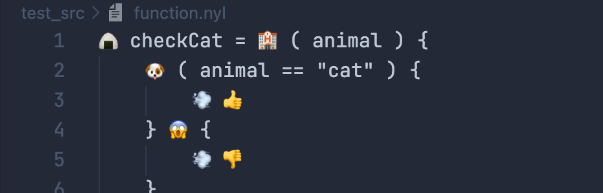

# nylang



a cute programming language inspired by monkey language in rust

# install & uninstall

```
chmod +x scripts/install.sh && ./scripts/install.sh
```

```
chmod +x scripts/uninstall.sh && ./scripts/uninstall.sh
```

# excution

- show help

```
nylang
```

- run program

```
nylang run <filename>.nyl
```

# nylang documentation

## reserved word

- 🐶 to conditional check: If Expression
```
🐶 ( 👍 == 👍 ) { } 😱 { } ; 
```

- 💨 to return: Return Expression
```
💨 "cat"
```

- 🏨 to make a new closure expression: Closure Expression
```
🏨 ( A , B ) { } ;
```

- 🍙 to make a variable and assign in environment: Void
```
🍙 cat = "cat" ;
```

- 🌸 to loop

usage 1: with a loop number
```
🌸 ( 
    🏨 ( ) { // function
        // statement
    } , 
    100 // loop number
)
```

usage 2: without loop number but the function returns boolean
```

🍙 cnt = 0 ;

🌸 ( 
    🏨 ( ) { // function
        🍙 cnt = cnt + 1 ;
        💨 cnt != 100 // loop till the function returns false
    }
)
```

# types

- number

```
123456789
```

- boolean

```
👍 👎
```

- string
```
"hoge"
```

## builtin functions

- 🎤(🎶) to print out

```
🎤🎶 ( "hoge" ) ; // prints hoge\n
```

- 😪 to sleep

```
😪 ( 500 ) ; // wait 0.5s 
```